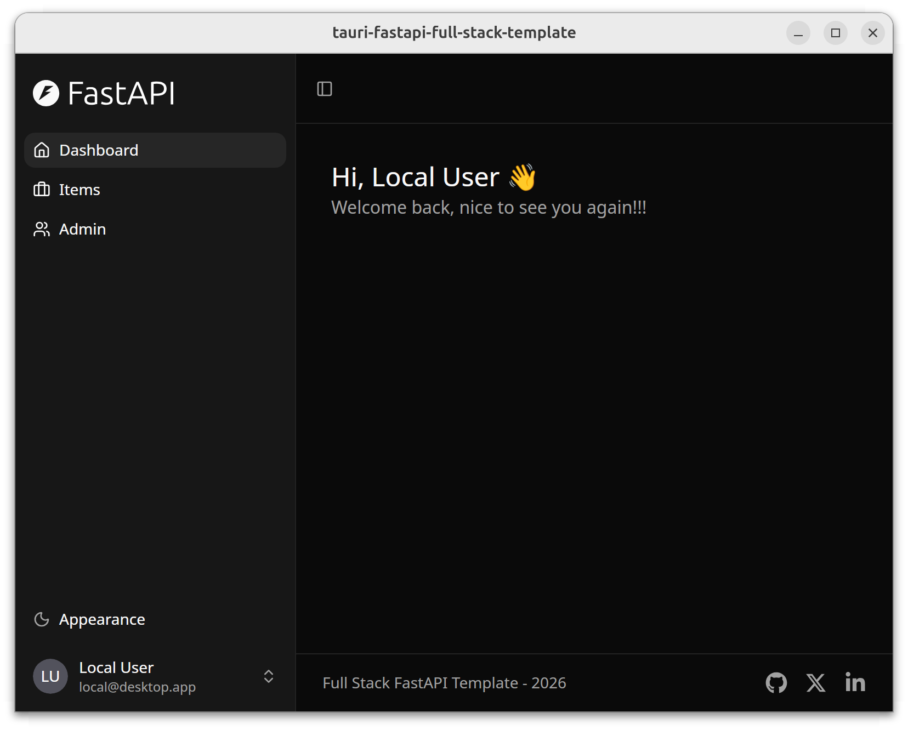
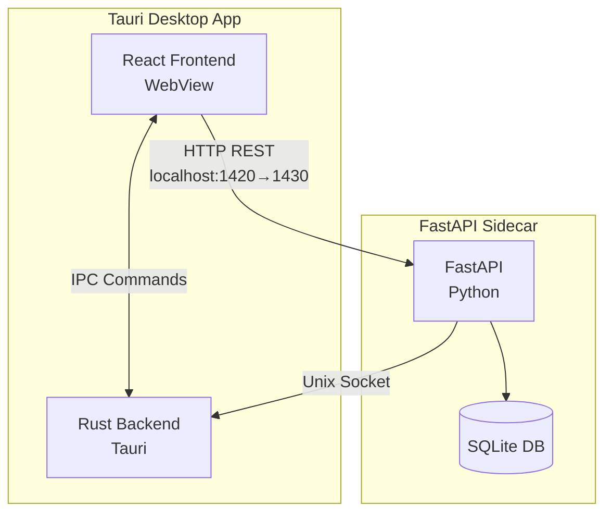
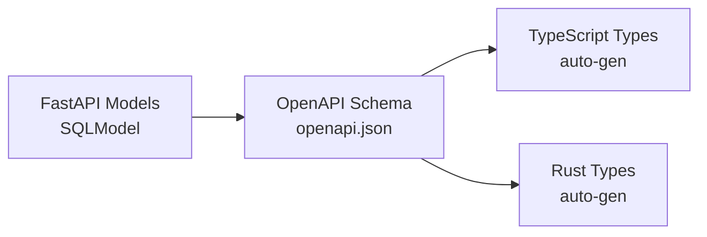

# Tauri + FastAPI Full Stack Template

> A **template** for building desktop applications with Tauri (Rust), FastAPI (Python), and React (TypeScript).

This project combines two excellent templates:

- **[Tauri](https://tauri.app)** - Cross-platform desktop apps with Rust
- **[FastAPI Full Stack Template](https://github.com/fastapi/full-stack-fastapi-template)** - Production-ready backend/frontend stack (forked from commit [`1c6d656`](https://github.com/fastapi/full-stack-fastapi-template/commit/1c6d6564))

This is a **starter template** designed to be customized for your own application. It provides a complete full-stack desktop app foundation with optional authentication.



## Architecture & Tech Stack

### Technology Stack

- **Frontend**: React + TypeScript with Vite, TanStack Router, TanStack Query, Tailwind CSS, shadcn/ui
- **Backend**: FastAPI with SQLite, SQLModel, Alembic migrations, Pydantic settings
- **Desktop**: Tauri 2 with sidecar architecture (FastAPI runs as bundled binary)
- **Auth**: Optional - disabled by default for local desktop use
- **Build**: PyInstaller bundles Python backend into single binary, Tauri creates native installers

### Architecture Overview

This is a **three-process desktop application**:



**How the processes communicate**:
- **Frontend → Tauri**: IPC commands (native operations like windows, file dialogs)
- **Frontend → FastAPI**: HTTP REST (database queries, business logic)
- **Tauri → FastAPI**: HTTP (health checks during startup)
- **FastAPI → Tauri**: Unix socket (desktop features like window control)

📖 **See [docs/IPC.md](docs/IPC.md)** for complete documentation on communication patterns.

### Project Structure

```
├── frontend/          # React + TypeScript + Vite
│   ├── src/
│   │   ├── routes/   # TanStack Router file-based routing
│   │   ├── components/
│   │   ├── client/   # API client (auto-generated)
│   │   └── hooks/    # React hooks (useAuth, etc.)
│   └── openapi.json  # OpenAPI schema (auto-generated)
├── fastapi/          # Python FastAPI backend
│   ├── app/
│   │   ├── api/      # API routes
│   │   ├── core/     # Config, DB, logging
│   │   ├── models.py # SQLModel database models
│   │   └── crud/     # Database operations
│   └── alembic/      # Database migrations
├── tauri/            # Rust desktop app
│   ├── src/
│   │   ├── lib.rs    # Main app, sidecar management
│   │   └── config.rs # Rust config from env vars
│   └── binaries/     # Bundled sidecar binary (generated)
└── scripts/          # Utility scripts (generate-client, etc.)
```

### Data Management

**Database**: SQLite (included with Python standard library, no external server needed)

**Location**:
- **Dev**: `.data/app.db` (project root)
- **Production (Linux)**: `~/.local/share/com.example.tauri-fastapi-full-stack-template/app.db`
- **Production (macOS)**: `~/Library/Application Support/com.example.tauri-fastapi-full-stack-template/app.db`
- **Production (Windows)**: `%APPDATA%\com.example.tauri-fastapi-full-stack-template\app.db`

**Models**: SQLModel with automatic TypeScript/Rust type generation via OpenAPI



**Migrations**: Alembic for schema version control

📖 **See [docs/data-management.md](docs/data-management.md)** for complete documentation on data storage, migrations, and models.

## Development

### Quick Start

Get the app running in 3 steps:

**1. Install system tools** (first time only):

- [Rust](https://www.rust-lang.org/tools/install) (via rustup)
- [bun](https://bun.sh/docs/installation/) (includes Node.js)
- [uv](https://docs.astral.sh/uv/getting-started/installation/) (includes Python)

**2. Install project dependencies** (first time only):

```bash
make setup
```

This installs:
- Tauri CLI (via cargo)
- Frontend dependencies (via bun)
- Backend Python packages (via uv)

**3. Run the app**:

```bash
# Terminal 1: Start the FastAPI backend
make fastapi

# Terminal 2: Start the Tauri desktop app
make dev
```

The app opens at http://localhost:1420 with the backend API at http://localhost:1430.

**Why two terminals?** In development mode, the backend runs separately so you get hot-reload and easier debugging. Tauri doesn't spawn the sidecar binary in dev mode.

### Requirements

**System tools** (install separately first):

1. **[Rust](https://www.rust-lang.org/tools/install)** (via rustup)
   - Required by Tauri
   - After installing Rust, `make setup` will install [Tauri CLI](https://tauri.app/v2/guides/getting-started/prerequisites)

2. **[bun](https://bun.sh/docs/installation/)**
   - Includes [Node.js](https://nodejs.org/) runtime
   - Frontend package manager

3. **[uv](https://docs.astral.sh/uv/getting-started/installation/)**
   - Includes [Python 3.11+](https://www.python.org/downloads/) runtime
   - Backend package manager

4. **System**: Linux, macOS, or Windows

### Frontend Development

**Stack**: React + TypeScript, Vite, TanStack Router (file-based), TanStack Query, Tailwind CSS, shadcn/ui

**File structure**:
```
frontend/src/
├── routes/          # File-based routing (TanStack Router)
├── components/      # Reusable UI components
├── client/          # Auto-generated API client
└── hooks/           # Custom React hooks
```

**Typical tasks**:

1. **Add a new page/route**:
   ```bash
   # Create route file
   touch frontend/src/routes/about.tsx
   ```
   ```typescript
   // frontend/src/routes/about.tsx
   import { createFileRoute } from '@tanstack/react-router'

   export const Route = createFileRoute('/about')({
     component: About,
   })

   function About() {
     return <div>About Page</div>
   }
   ```

2. **Add a widget/component**:
   ```bash
   # Create component
   touch frontend/src/components/StatsCard.tsx
   ```
   ```typescript
   // frontend/src/components/StatsCard.tsx
   export function StatsCard({ title, value }: { title: string; value: number }) {
     return (
       <div className="p-4 border rounded-lg">
         <h3 className="text-lg font-semibold">{title}</h3>
         <p className="text-2xl">{value}</p>
       </div>
     )
   }
   ```

3. **Call API endpoints**:
   ```typescript
   import { client } from '@/client/client'
   import { useQuery, useMutation } from '@tanstack/react-query'

   // GET request
   const { data: users } = useQuery({
     queryKey: ['users'],
     queryFn: () => client.GET('/api/v1/users/'),
   })

   // POST request
   const createUser = useMutation({
     mutationFn: (data: UserCreate) =>
       client.POST('/api/v1/users/', { body: data }),
   })
   ```

4. **Styling with Tailwind**:
   ```typescript
   // Utility classes for styling
   <div className="flex items-center gap-4 p-4 bg-white rounded-lg shadow">
     {/* Content */}
   </div>
   ```

**Hot reload**: Vite automatically reloads the frontend when you save changes.

### FastAPI Backend Development

**Stack**: FastAPI, SQLModel, Alembic (migrations), Pydantic (validation)

**File structure**:
```
fastapi/app/
├── api/             # API routes
├── core/            # Config, database, logging
├── models.py        # SQLModel database models
└── crud.py          # Database operations
```

**Data models** (detailed docs: [docs/data-management.md](docs/data-management.md)):

1. **Add a new model**:
   ```python
   # fastapi/app/models.py
   from sqlmodel import SQLModel, Field
   from datetime import datetime
   from uuid import UUID, uuid4

   class ProductBase(SQLModel):
       name: str = Field(max_length=255)
       price: float = Field(gt=0)

   class Product(ProductBase, table=True):
       id: UUID = Field(default_factory=uuid4, primary_key=True)
       created_at: datetime = Field(default_factory=datetime.utcnow)
   ```

2. **Create database migration**:
   ```bash
   cd fastapi
   uv run alembic revision --autogenerate -m "add products"
   uv run alembic upgrade head
   ```

3. **Regenerate API clients**:
   ```bash
   make generate-client
   ```

4. **Add API endpoint**:
   ```python
   # fastapi/app/api/routes/products.py
   from fastapi import APIRouter, Depends
   from app.models import Product, ProductCreate
   from app.crud import create_product

   router = APIRouter()

   @router.post("/", response_model=Product)
   def create_new_product(
       product: ProductCreate,
       session: Session = Depends(get_session),
   ):
       return create_product(session, product)
   ```

5. **Update model (add/remove fields)**:
   ```python
   # Edit model in models.py
   class ProductBase(SQLModel):
       name: str = Field(max_length=255)
       price: float = Field(gt=0)
       description: str | None = Field(default=None)  # New field

   # Create migration
   cd fastapi
   uv run alembic revision --autogenerate -m "add product description"
   uv run alembic upgrade head

   # Regenerate API clients
   make generate-client
   ```

**Test API**:
- Swagger UI: http://localhost:1430/docs (interactive API docs)
- ReDoc: http://localhost:1430/redoc (alternative docs)

### Tauri (Rust) Development

**Stack**: Rust, Tauri 2

**File structure**:
```
tauri/src/
├── lib.rs           # Main app, Tauri commands
├── config.rs        # Rust config from environment variables
└── socket_server.rs # Unix socket server for FastAPI → Rust communication
```

**Typical tasks**:

1. **Add a Rust dependency**:
   ```toml
   # tauri/Cargo.toml
   [dependencies]
   serde_json = "1.0"
   ```

2. **Add a Tauri command (IPC)**:
   ```rust
   // tauri/src/lib.rs
   #[tauri::command]
   fn greet(name: &str) -> String {
       format!("Hello, {}!", name)
   }

   // Register in main()
   fn main() {
       tauri::Builder::default()
           .invoke_handler(tauri::generate_handler![greet])
           .run(tauri::generate_context!())
           .expect("error while running tauri application");
   }
   ```

3. **Call Tauri command from frontend**:
   ```typescript
   import { invoke } from '@tauri-apps/api/core'

   const greeting = await invoke('greet', { name: 'World' })
   ```

4. **Test Tauri commands**:
   ```bash
   # Run Tauri dev (requires backend running separately)
   make dev
   ```

5. **Build Rust backend**:
   ```bash
   # Build only the Rust part
   cd tauri
   cargo build
   ```

**Communication with FastAPI**: See [docs/IPC.md](docs/IPC.md) for Unix socket communication patterns.

### Make Targets

```bash
make setup            # Install all dependencies
make dev              # Run development mode (requires backend running)
make dev-frontend     # Frontend only (if backend is already running)
make fastapi          # Backend only (for debugging)
make init-db          # Initialize/reset database
make generate-client  # Generate API clients from OpenAPI schema
make package-backend  # Package FastAPI backend binary
make package          # Package production bundles
make clean            # Clean all build artifacts
make help             # Show all targets
```

### Customization

This is a **template** - customize these project-specific settings for your application:

**1. Rename the app** - Edit `tauri/tauri.conf.json`:
```json
{
  "productName": "your-app-name",
  "identifier": "com.yourcompany.your-app-name",
  "title": "Your App Name"
}
```

**2. Update backend config** - Edit `fastapi/app/core/config.py`:
```python
PROJECT_NAME: str = "Your App Name"
AUTH_REQUIRED: bool = False  # Set to True to enable authentication
```

**3. Update frontend branding** - Edit `frontend/src/routes/_layout.tsx`:
```typescript
// Change page title, branding, etc.
```

For adding features (routes, models, API endpoints), see the [Development](#development) sections above.

### Building for Production

Package the distributable application:

```bash
# Package everything (frontend + backend binary + Tauri app)
make package

# Or package step by step:
make package-backend  # PyInstaller: tauri/binaries/fastapi-server-{arch}-{os}
cargo tauri build     # Creates .deb, .rpm, .AppImage (Linux)
```

Output: `tauri/target/release/bundle/`

**What happens during build**:
1. Frontend builds to static files
2. Python backend bundles into PyInstaller binary
3. Tauri creates platform-specific installers
4. In production, Tauri automatically spawns the FastAPI sidecar with proper data directory

## License

MIT - use this template for anything you want.
