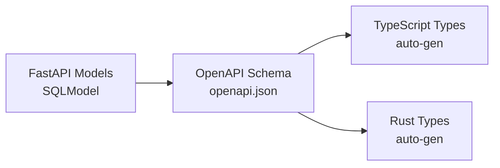

# Tauri + FastAPI Full Stack Template

> A **template** for building desktop applications with Tauri (Rust), FastAPI (Python), and React (TypeScript).

This project combines two excellent templates:

- **[Tauri](https://tauri.app)** - Cross-platform desktop apps with Rust
- **[FastAPI Full Stack Template](https://github.com/fastapi/full-stack-fastapi-template)** - Production-ready backend/frontend stack (forked from commit [`1c6d656`](https://github.com/fastapi/full-stack-fastapi-template/commit/1c6d6564))

This is a **starter template** designed to be customized for your own application. It provides a complete full-stack desktop app foundation with optional authentication.


## Features

- **Frontend**: React + TypeScript with Vite, TanStack Router, TanStack Query, Tailwind CSS, shadcn/ui
- **Backend**: FastAPI with SQLite, SQLModel, Alembic migrations, Pydantic settings
- **Desktop**: Tauri 2 with sidecar architecture (FastAPI runs as bundled binary)
- **Auth**: Optional - disabled by default for local desktop use
- **Build**: PyInstaller bundles Python backend into single binary, Tauri creates native installers

## Quick Start

```bash
# Install dependencies
make setup

# Terminal 1: Start the FastAPI backend
make fastapi

# Terminal 2: Start the Tauri desktop app
make dev
```

**Why two terminals?** In development mode, Tauri doesn't spawn the sidecar binary (it uses the dev server instead). The backend runs separately so you get hot-reload and easier debugging. The app opens at http://localhost:1420 with the backend API at http://localhost:1430.

## Development

```bash
# Run full app (Tauri + frontend dev server + separate backend)
make dev

# Run only frontend dev server (if backend is already running)
make dev-frontend

# Run only backend (for debugging)
make fastapi

# Initialize/reset database
make init-db

# Generate API clients from backend OpenAPI schema
make generate-client
```

## Building for Production

```bash
# Build everything (frontend + backend binary + Tauri app)
make build

# Or build step by step:
make build-backend    # PyInstaller: tauri/binaries/fastapi-server-{arch}-{os}
cargo tauri build     # Creates .deb, .rpm, .AppImage (Linux)
```

Output: `tauri/target/release/bundle/`

## Customizing This Template ("Second Dev")

This is a **template** - you'll need to customize it for your application:

### 1. Rename the App

Edit `tauri/tauri.conf.json`:

```json
{
  "productName": "your-app-name",
  "identifier": "com.yourcompany.your-app-name",
  "title": "Your App Name"
}
```

### 2. Update Backend Config

Edit `fastapi/app/core/config.py`:

```python
PROJECT_NAME: str = "Your App Name"
AUTH_REQUIRED: bool = False  # Set to True to enable authentication
```

### 3. Update Frontend

- Edit `frontend/src/routes/_layout.tsx` - change page title, branding
- Replace shadcn/ui components in `frontend/src/components/`
- Add your routes in `frontend/src/routes/`

### 4. Update Database Models

- Edit `fastapi/app/models.py` - add your SQLModel models
- Create migration: `cd fastapi && uv run alembic revision --autogenerate -m "description"`
- Run migrations: `uv run alembic upgrade head`

### 5. Update API Routes

- Add routes in `fastapi/app/api/deps/` (per-feature modules)
- Import in `fastapi/app/api/main.py`

### 6. Regenerate API Clients

After changing backend models/routes:

```bash
make generate-client
```

This regenerates TypeScript and Rust clients from the OpenAPI schema.

## Project Structure

```
├── frontend/          # React + TypeScript + Vite
│   ├── src/
│   │   ├── routes/   # TanStack Router file-based routing
│   │   ├── components/
│   │   ├── client/   # API client (auto-generated)
│   │   └── hooks/    # React hooks (useAuth, etc.)
│   └── openapi.json  # OpenAPI schema (auto-generated)
├── fastapi/          # Python FastAPI backend
│   ├── app/
│   │   ├── api/      # API routes
│   │   ├── core/     # Config, DB, logging
│   │   ├── models.py # SQLModel database models
│   │   └── crud/     # Database operations
│   └── alembic/      # Database migrations
├── tauri/            # Rust desktop app
│   ├── src/
│   │   ├── lib.rs    # Main app, sidecar management
│   │   └── config.rs # Rust config from env vars
│   └── binaries/     # Bundled sidecar binary (generated)
└── scripts/          # Utility scripts (generate-client, etc.)
```

## Architecture

This is a backend/frontend desktop application. The Python FastAPI backend handles data persistence and business logic, while the React frontend provides the UI. Tauri wraps everything as a desktop app.

### Database Management (SQLite + Alembic)

**Database**: SQLite for simplicity (no external server needed)

**Migrations**: Alembic for schema version control

```bash
# Create a migration after changing models
cd fastapi
uv run alembic revision --autogenerate -m "description"

# Apply migrations
uv run alembic upgrade head

# In production: migrations run automatically on first startup
# (Schema created from SQLModel models, no alembic files needed)
```

**Development vs Production**:
- **Dev**: Alembic migrations run on startup (`make fastapi` or `make dev`)
- **Production**: Tables created from SQLModel models (alembic files bundled but not used)

**Reset database**:
```bash
make init-db  # Re-initializes database with default user
```

**Database Location**:
- **Dev**: `.data/app.db` (project root)
- **Production (Linux)**: `~/.local/share/com.glp.tauri-fastapi-full-stack-template/app.db`
- **Production (macOS)**: `~/Library/Application Support/com.glp.tauri-fastapi-full-stack-template/app.db`
- **Production (Windows)**: `%APPDATA%\com.glp.tauri-fastapi-full-stack-template\app.db`

📖 **See [docs/data-management.md](docs/data-management.md)** for complete documentation on data storage, migrations, and models.

### Data Models (SQLModel + OpenAPI Codegen)

**Model Flow**: `FastAPI/SQLModel → OpenAPI JSON → TypeScript + Rust Types`



Models are defined **once** in `fastapi/app/models.py` using [SQLModel](https://sqlmodel.tutorial.fastapi.to/):

```python
# fastapi/app/models.py
from sqlmodel import Field, SQLModel
from typing import Optional

class User(SQLModel, table=True):
    id: str = Field(default_factory=lambda: uuid4().hex, primary_key=True)
    email: str = Field(unique=True, index=True)
    full_name: Optional[str] = None
    is_active: bool = True
```

**Types are auto-generated for both frontend and backend** - no manual type definitions needed:

```typescript
// frontend/src/client/types.ts - AUTO-GENERATED
export interface User {
  id: string;
  email: string;
  full_name?: string;
  is_active: boolean;
}
```

```rust
// tauri/src/client/types.rs - AUTO-GENERATED
#[derive(Serialize, Deserialize)]
pub struct User {
    pub id: String,
    pub email: String,
    pub full_name: Option<String>,
    pub is_active: bool,
}
```

**Adding a model**:

1. Define model in `fastapi/app/models.py`
2. Create migration: `uv run alembic revision --autogenerate -m "add model"`
3. Apply migration: `uv run alembic upgrade head`
4. Regenerate clients: `make generate-client`

📖 **See [docs/data-management.md](docs/data-management.md)** for complete documentation on model types, hierarchies, and code generation.

### Sidecar Pattern

The FastAPI backend runs as a separate process (sidecar) that Tauri spawns:

- **Development**: Backend runs separately via `uvicorn` (make dev starts both)
- **Production**: Backend is bundled as PyInstaller binary, Tauri spawns it with `DATA_DIR` set to app data directory

### Inter-Process Communication (IPC)

This template uses a **three-process architecture** where Frontend, Tauri (Rust), and FastAPI (Python) communicate through different methods depending on the use case:

- **Frontend → Tauri**: IPC commands (native operations like windows, file dialogs)
- **Frontend → FastAPI**: HTTP REST (database queries, business logic)
- **Tauri → FastAPI**: HTTP (health checks during startup)
- **FastAPI → Tauri**: Unix socket (desktop features like window control)

**Example**: The "Toggle Maximize" button on the dashboard demonstrates this architecture:
1. Frontend calls `POST /api/v1/window`
2. FastAPI forwards to Unix socket
3. Rust Axum server processes request
4. Tauri maximizes/restores the window

📖 **See [docs/IPC.md](docs/IPC.md)** for complete documentation on communication patterns.

### Auth (Optional)

Authentication is **disabled by default**. To enable:

```python
# fastapi/app/core/config.py
AUTH_REQUIRED: bool = True
```

Then the app will require login and use JWT tokens.

## Make Targets

```bash
make setup          # Install all dependencies
make dev            # Run development mode
make dev-frontend   # Frontend only
make fastapi        # Backend only
make init-db        # Initialize database
make generate-client # Generate API clients
make build-backend  # Build PyInstaller binary
make build          # Build production bundles
make clean          # Clean all build artifacts
make help           # Show all targets
```

## Requirements

- **Rust** (via rustup) - Tauri
- **Node.js** + **bun** - Frontend
- **Python 3.11+** + **uv** - Backend
- **System**: Linux, macOS, or Windows

## License

MIT - use this template for anything you want.
