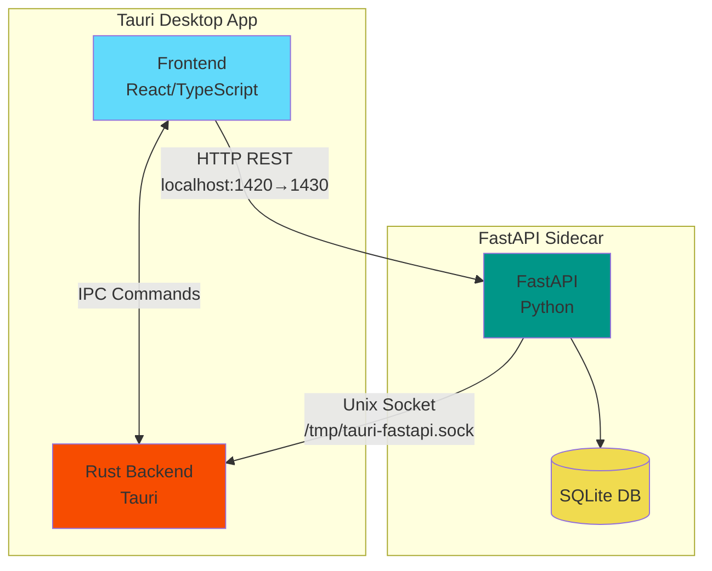
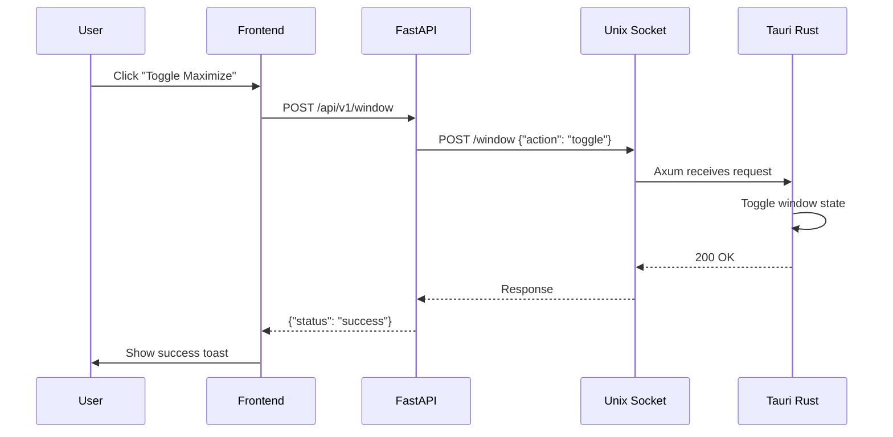
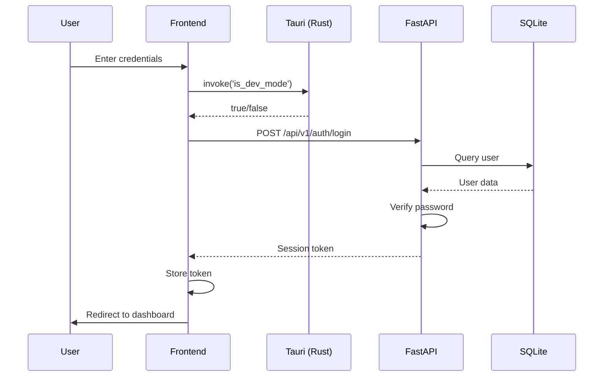
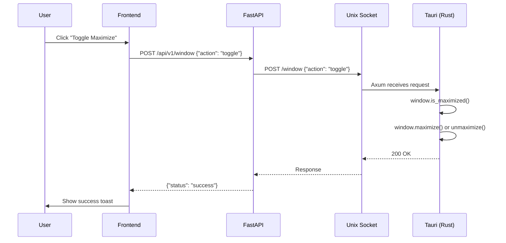
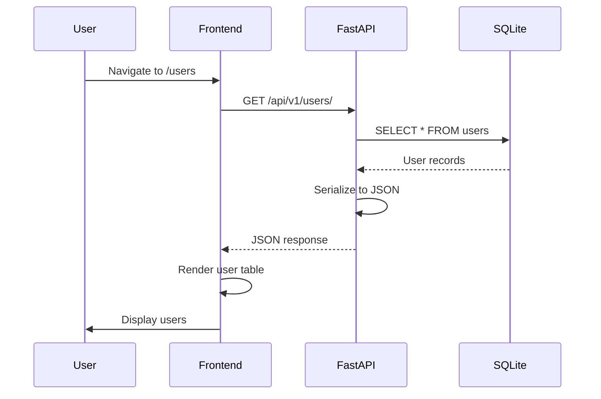

# Inter-Process Communication (IPC)

This document describes how the frontend, Tauri (Rust backend), and FastAPI (Python sidecar) communicate with each other.

## Table of Contents

- **[Overview](#overview)**
- **[Why This Architecture?](#why-this-architecture)**
- **[Communication Patterns](#communication-patterns)**
- **[Architecture Overview](#architecture-overview)**
- **[1. Frontend → Tauri (Rust)](#1-frontend--tauri-rust)** - Tauri Commands (IPC)
- **[2. Frontend → FastAPI](#2-frontend--fastapi)** - HTTP REST
- **[3. Tauri (Rust) → FastAPI](#3-tauri-rust--fastapi)** - HTTP (ureq)
- **[4. FastAPI → Tauri (Rust)](#4-fastapi--tauri-rust)** - Unix Socket
- **[Summary Table](#summary-table)**
- **[Communication Flow Examples](#communication-flow-examples)**
- **[Recommendations](#recommendations)**

---

## Overview

This template uses a **three-process architecture**:

1. **Frontend (React/TypeScript)** - Runs in Tauri WebView, handles UI and user interactions
2. **Tauri (Rust Backend)** - Desktop app shell, manages native OS features and system integration
3. **FastAPI (Python Sidecar)** - Business logic server, handles database operations and API endpoints

## Why This Architecture?

Each process has a specific purpose:

| Component | Responsibility | Why Separate? |
|-----------|---------------|---------------|
| **Frontend** | UI/UX, user interactions | Web technologies are fast to develop and familiar |
| **Tauri (Rust)** | Native OS access, windows, tray | Rust provides safe, low-level system access |
| **FastAPI (Python)** | Business logic, database | Python ecosystem has excellent libraries for data processing |

## Communication Patterns

The three processes communicate in **four directions**:

1. **Frontend → Tauri** (IPC Commands) - Native operations like file dialogs, windows
2. **Frontend → FastAPI** (HTTP REST) - Database queries, business logic
3. **Tauri → FastAPI** (HTTP) - Health checks during startup
4. **FastAPI → Tauri** (Unix Socket) - Desktop features like window control

Each direction uses the appropriate method for its use case, balancing performance, security, and developer experience.

---

## Architecture Overview



## 1. Frontend → Tauri (Rust)

**Method**: Tauri Commands (IPC)

**Documentation**: https://tauri.app/v2/api/js/namespacecore/#function-invoke

Tauri provides a command-based IPC system. The frontend invokes Rust functions directly using `invoke()`.

### Rust Side
```rust
// tauri/src/lib.rs
#[tauri::command]
fn get_data_dir(app: tauri::AppHandle) -> Result<String, String> {
    app.path()
        .app_data_dir()
        .map(|p| p.to_string_lossy().to_string())
        .map_err(|e| e.to_string())
}

// Register commands
fn main() {
    tauri::Builder::default()
        .invoke_handler(tauri::generate_handler![
            get_data_dir,
            is_dev_mode,
            toggle_window_maximize,
        ])
        .run(tauri::generate_context!())
        .expect("error while running tauri application");
}
```

### Frontend Side
```typescript
import { invoke } from '@tauri-apps/api/core';

interface WindowStateResponse {
  success: boolean;
  message: string;
}

// Call Tauri command
export async function toggleWindowMaximize(): Promise<WindowStateResponse> {
  return invoke<WindowStateResponse>('toggle_window_maximize');
}
```

**Use cases**:
- OS-level operations (file system, native dialogs)
- Desktop-specific features (windows, tray)
- Hardware access (USB, Bluetooth, serial ports)
- Performance-critical operations

## 2. Frontend → FastAPI

**Method**: HTTP REST

**Documentation**: https://fastapi.tiangolo.com/

The frontend calls the FastAPI backend using standard HTTP requests. API clients are auto-generated from the OpenAPI schema.

### Frontend Side
```typescript
// frontend/src/services/api.ts - AUTO-GENERATED
import { client } from './client';

export async function getUsers() {
  return client.GET('/api/users/');
}

export async function createUser(data: UserCreate) {
  return client.POST('/api/users/', { body: data });
}
```

### FastAPI Side
```python
# fastapi/app/api/routes/users.py
from fastapi import APIRouter, Depends
from app.models import User, UserCreate
from app.crud import create_user

router = APIRouter()

@router.post("/", response_model=User)
def create_new_user(user: UserCreate, session: Session = Depends(get_session)):
    return create_user(session=session, user=user)
```

**Use cases**:
- Database operations (CRUD)
- Business logic
- Authentication (if enabled)
- Data processing and validation
- Background tasks

## 3. Tauri (Rust) → FastAPI

**Implementation**: HTTP (ureq client)

**Documentation**: https://docs.rs/ureq/

Rust calls FastAPI using synchronous HTTP requests via the `ureq` library. This is used for health checks and initialization.

### Rust Implementation

**Rust Side** (`tauri/src/lib.rs`):
```rust
use ureq;

fn wait_for_backend() -> Result<(), String> {
    let health_endpoint = SETTINGS.health_endpoint(); // "http://localhost:1430/api/v1/health"
    let timeout = SETTINGS.health_check_timeout();
    let start = Instant::now();

    while start.elapsed() < timeout {
        match ureq::get(&health_endpoint).call() {
            Ok(response) if response.status() == 200 => {
                log::info!("Backend is ready (took {:?})", start.elapsed());
                return Ok(());
            }
            Ok(response) => {
                log::debug!("Health check returned status {}", response.status());
            }
            Err(e) => {
                log::debug!("Health check failed: {}", e);
            }
        }
        thread::sleep(SETTINGS.health_check_interval());
    }

    Err(format!(
        "Backend not ready after {:?}. Is it running? Try: make fastapi",
        timeout
    ))
}
```

**FastAPI Side** (`fastapi/app/api/main.py`):
```python
@router.get("/health")
async def health_check():
    """Health check endpoint for Rust backend."""
    return {"status": "healthy"}
```

**Use cases**:
- Health checks during startup (implemented)
- Verifying FastAPI is ready before proceeding
- Simple one-way requests from Rust to Python

**Note**: Database operations should stay in FastAPI. Rust should call FastAPI endpoints rather than accessing the database directly.

## 4. FastAPI → Tauri (Rust)

**Implementation**: Unix Socket (Axum Server)

**Documentation**: https://docs.rs/axum/

FastAPI communicates with Tauri through the Unix socket server running in Rust. This is used for desktop-specific features like window state control.

### Rust Side (Axum Server)

**File**: `tauri/src/socket_server.rs`

```rust
use axum::{routing::{get, post}, Json, Router};
use tokio::net::UnixListener;

async fn toggle_window_state(Json(req): Json<WindowStateRequest>) -> Json<SocketResponse> {
    // Handle window state logic
    Json(SocketResponse {
        success: true,
        message: "Window state changed".to_string(),
    })
}

pub async fn run_socket_server(app_handle: AppHandle) -> Result<(), Box<dyn std::error::Error>> {
    let socket_path = PathBuf::from("/tmp/tauri-fastapi.sock");
    let listener = UnixListener::bind(&socket_path)?;

    let app = Router::new()
        .route("/health", get(health))
        .route("/window", post(toggle_window_state));

    axum::serve(listener, app).await?;
    Ok(())
}
```

### FastAPI Side (Unix Socket Client)

**File**: `fastapi/app/api/routes/window.py`

```python
import socket
import json

@router.post("/window")
async def toggle_window_state(request: WindowStateRequest):
    socket_path = "/tmp/tauri-fastapi.sock"
    sock = socket.socket(socket.AF_UNIX, socket.SOCK_STREAM)
    sock.connect(socket_path)

    body = json.dumps({"action": request.action}).encode()
    http_request = (
        f"POST /window HTTP/1.1\r\n"
        f"Host: localhost\r\n"
        f"Content-Type: application/json\r\n"
        f"Content-Length: {len(body)}\r\n"
        f"\r\n".encode()
    )

    sock.sendall(http_request + body)
    response = sock.recv(4096).decode()
    sock.close()

    return {"status": "success", "message": "Window state changed"}
```

### Example: Window State Control

**Current implementation**:
1. User clicks "Toggle Maximize" button in frontend
2. Frontend calls `POST /api/v1/window`
3. FastAPI forwards request to Unix socket
4. Rust Axum server receives and processes request
5. Tauri maximizes/restores the window



### Socket Path

| Platform | Socket Path |
|----------|-------------|
| Linux | `$XDG_RUNTIME_DIR/tauri-fastapi.sock` or `/tmp/tauri-fastapi.sock` |
| macOS | `/tmp/tauri-fastapi.sock` |
| Windows | `C:\Users\<user>\AppData\Local\Temp\tauri-fastapi.sock` |

**Benefits of Unix Socket**:
- ✅ Better security (filesystem permissions)
- ✅ Lower latency (no TCP overhead)
- ✅ No port conflicts
- ✅ Works on all platforms (Linux, macOS, Windows 10+)

## Summary Table

| Direction | Method | Implementation | Use Cases |
|-----------|--------|----------------|-----------|
| Frontend → Rust | IPC (Tauri Commands) | Built-in, `invoke()` | Native operations, system access |
| Frontend → FastAPI | HTTP REST | Auto-generated clients | Database, business logic, auth |
| FastAPI → Rust | Unix Socket | Axum server + Python socket client | Window control, desktop integration |

## Communication Flow Examples

### Example 1: User Login

Frontend checks if running in dev mode (optional), then authenticates with FastAPI:



### Example 2: Toggle Window Maximize

Frontend triggers window state change through FastAPI to Rust:



### Example 3: Database Query

Frontend fetches data from FastAPI:



## Recommendations

1. **Use Tauri commands** for anything native (files, windows, system features)
2. **Keep all database operations in FastAPI** - don't access SQLite directly from Rust
3. **Unix socket** for FastAPI → Rust when needing desktop features (window control, tray, etc.)
4. **HTTP (ureq)** for Rust → FastAPI for health checks and simple requests
5. **HTTP REST** for Frontend → FastAPI (standard, testable, auto-generated clients)
