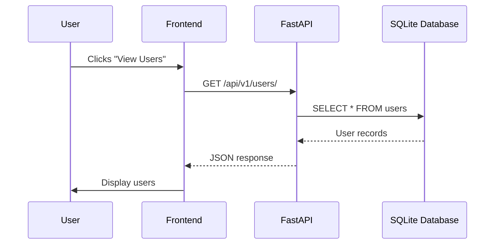
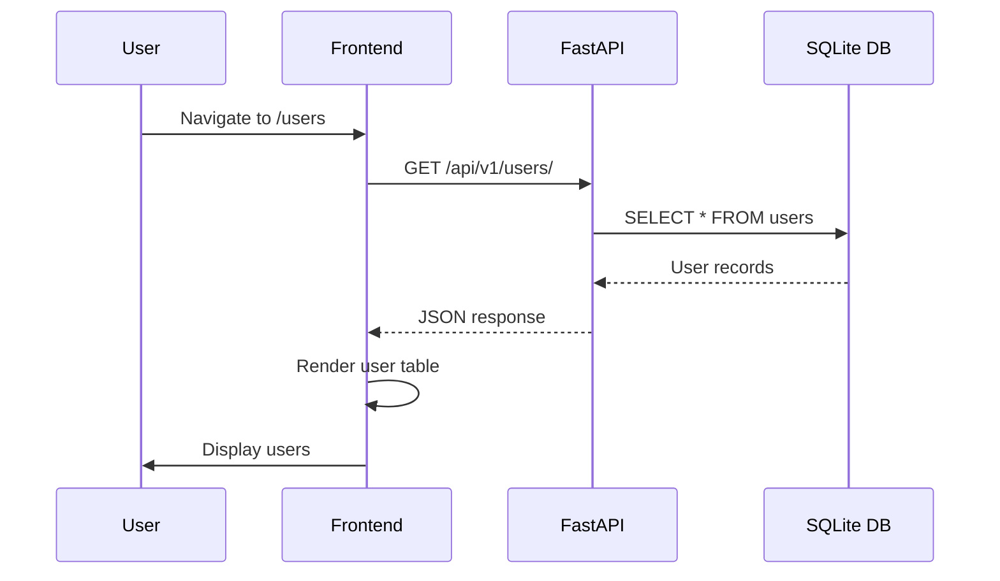
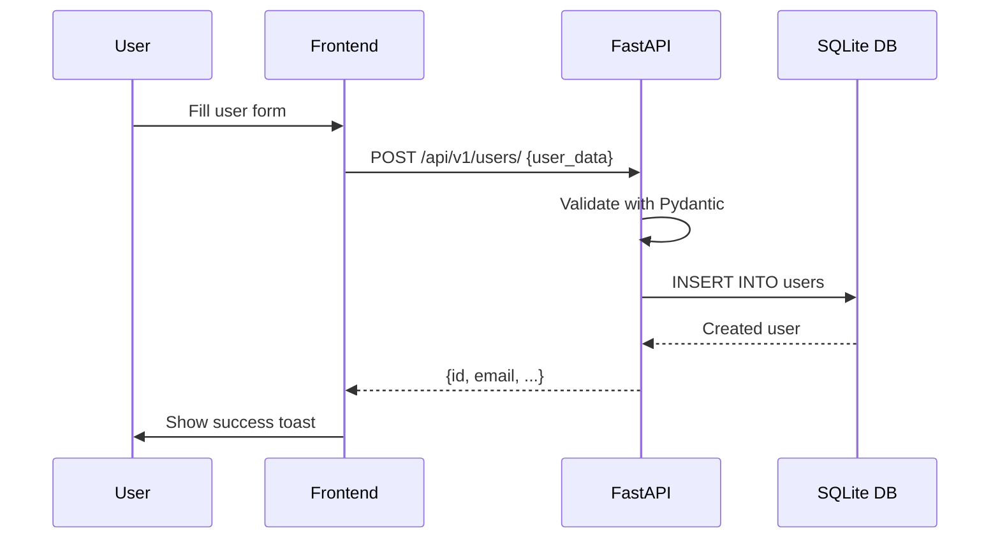
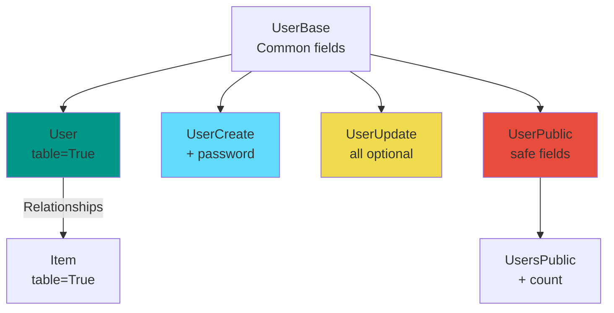
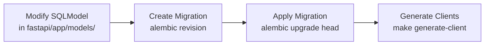
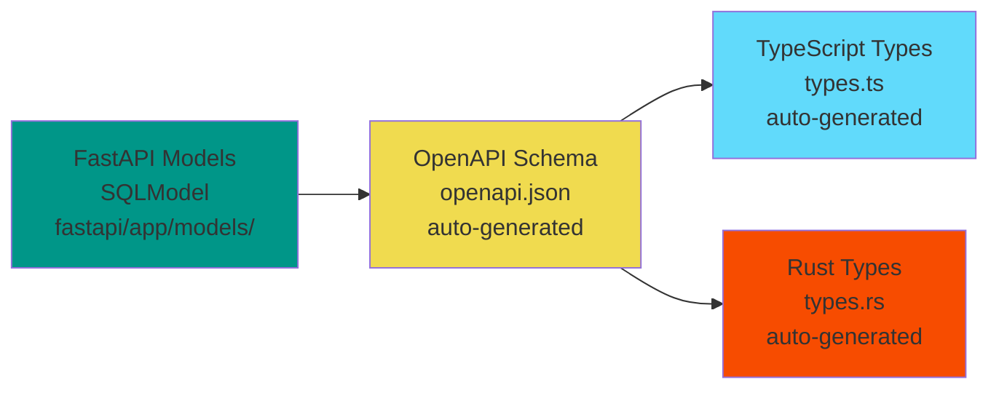

# Data Management

This document describes how data is stored, accessed, and managed across the three-process architecture (Frontend, Tauri, FastAPI).

## Table of Contents

- **[Overview](#overview)**
- **[Data Flow](#data-flow)**
- **[Managing Data Models](#managing-data-models)**
- **[Database Migrations (Alembic)](#database-migrations-alembic)**
- **[Model Sync Between Layers](#model-sync-between-layers)**
- **[SQLite Configuration](#sqlite-configuration)**

---

## Overview

This app uses SQLite for local data storage, with the database file stored in the platform-specific app data directory managed by Tauri.

### Directory Locations

The data directory location varies by platform:

| Platform | Path |
|----------|------|
| **Linux** | `~/.local/share/com.glp.tauri-fastapi-full-stack-template/` |
| **macOS** | `~/Library/Application Support/com.glp.tauri-fastapi-full-stack-template/` |
| **Windows** | `C:\Users\<user>\AppData\Roaming\com.glp.tauri-fastapi-full-stack-template\` |

The identifier comes from `tauri.conf.json` → `identifier`.

### What's Inside

```
{app_data_dir}/
└── app.db          # SQLite database (WAL mode)
```

### How It's Configured

The data directory path is passed to FastAPI via the `DATA_DIR` environment variable, but the setup differs between development and production:

**Development**: You set `DATA_DIR` manually when running the backend:

```bash
cd fastapi
DATA_DIR=./data uv run uvicorn app.main:app --reload --port 1430
```

The Rust code detects `debug_assertions` and skips spawning the sidecar, expecting the backend to be running externally.

**Production**: Tauri handles everything automatically:
1. Gets the platform-specific `app_data_dir()`
2. Creates the directory if it doesn't exist
3. Spawns the PyInstaller-bundled sidecar with `DATA_DIR` set
4. FastAPI stores `app.db` at `{DATA_DIR}/app.db`

### Environment Variables

FastAPI is configured via these environment variables:

| Variable | Required | Default | Description |
|----------|----------|---------|-------------|
| `DATA_DIR` | Yes | - | Directory for SQLite database |
| `HOST` | No | `127.0.0.1` | Server bind address |
| `PORT` | No | `1430` | Server port |
| `AUTH_REQUIRED` | No | `false` | Enable authentication |
| `DATABASE_NAME` | No | `app.db` | SQLite filename |

## Data Flow

In this architecture, data flows through the application in a clean, layered approach. The frontend (React) talks to the backend (FastAPI), which handles all database operations. This keeps concerns separated and makes the application easier to maintain.



**How the layers interact**:
- **Frontend** (React): Calls FastAPI HTTP endpoints using the auto-generated client
- **FastAPI** (Python): Handles business logic, validation, and database access
- **Rust** (Tauri): Manages the desktop app and spawns the FastAPI sidecar

**Benefits of this approach**:
1. **Security**: All data operations are validated through FastAPI endpoints
2. **Type Safety**: Auto-generated clients ensure types stay in sync across layers
3. **Separation of Concerns**: UI, business logic, and data access are cleanly separated
4. **Maintainability**: Database operations and business logic live in one place
5. **Testability**: Each layer can be tested independently

### Example: Fetching Users



### Example: Creating a User



## Managing Data Models

### Model Types

This template uses **two types of models**:

| Type | Purpose | Example | Has `table=True` |
|------|---------|---------|------------------|
| **Database Models** | Map to SQLite tables | `User`, `Item` | ✅ Yes |
| **Pydantic Models** | API request/response validation | `UserCreate`, `UserUpdate`, `UserPublic` | ❌ No |

### Model Hierarchy



### Type 1: Database Models (table=True)

These map directly to SQLite database tables:

```python
# fastapi/app/models.py
class User(UserBase, table=True):
    id: uuid.UUID = Field(default_factory=uuid.uuid4, primary_key=True)
    hashed_password: str  # Never expose in API
    created_at: datetime | None = Field(default_factory=get_datetime_utc)
    items: list["Item"] = Relationship(back_populates="owner", cascade_delete=True)

class Item(ItemBase, table=True):
    id: uuid.UUID = Field(default_factory=uuid.uuid4, primary_key=True)
    created_at: datetime | None = Field(default_factory=get_datetime_utc)
    owner_id: uuid.UUID = Field(foreign_key="user.id", nullable=False, ondelete="CASCADE")
    owner: User | None = Relationship(back_populates="items")
```

**Characteristics**:
- ✅ Inherit from base class AND `table=True`
- ✅ Include database-specific fields (`id`, `created_at`, foreign keys)
- ✅ Define relationships with other tables
- ✅ Never expose these directly in API responses

### Type 2: Pydantic Models (Request/Response)

These validate API requests and shape responses:

```python
# fastapi/app/models.py

# Base: Common fields shared across all user models
class UserBase(SQLModel):
    email: EmailStr = Field(unique=True, index=True, max_length=255)
    is_active: bool = True
    is_superuser: bool = False
    full_name: str | None = Field(default=None, max_length=255)

# Create: For POST /api/v1/users/ (includes password)
class UserCreate(UserBase):
    password: str = Field(min_length=8, max_length=128)

# Update: For PUT /api/v1/users/{id} (all optional)
class UserUpdate(UserBase):
    email: EmailStr | None = Field(default=None, max_length=255)
    password: str | None = Field(default=None, min_length=8, max_length=128)

# UpdateMe: For PATCH /api/v1/users/me (restricted fields)
class UserUpdateMe(SQLModel):
    full_name: str | None = Field(default=None, max_length=255)
    email: EmailStr | None = Field(default=None, max_length=255)

# Public: Safe fields for API responses (no password!)
class UserPublic(UserBase):
    id: uuid.UUID
    created_at: datetime | None

# List: Wrapper for multiple records
class UsersPublic(SQLModel):
    data: list[UserPublic]
    count: int
```

**Model Naming Convention**:

| Pattern | Used For | Example |
|---------|----------|---------|
| `*Base` | Shared fields | `UserBase`, `ItemBase` |
| `*Create` | POST requests | `UserCreate`, `ItemCreate` |
| `*Update` | PUT/PATCH requests | `UserUpdate`, `ItemUpdate` |
| `*Public` | Safe response fields | `UserPublic`, `ItemPublic` |
| `*sPublic` | List responses | `UsersPublic`, `ItemsPublic` |
| No suffix | Database table | `User`, `Item` (with `table=True`) |

### Why Separate Models?

**Security**: Never expose sensitive fields
```python
# ❌ BAD - Exposes hashed_password
class User(UserBase, table=True):
    hashed_password: str

# ✅ GOOD - UserPublic excludes password
class UserPublic(UserBase):
    id: uuid.UUID
    created_at: datetime | None
    # No hashed_password!
```

**Validation**: Different rules for different operations
```python
# Create requires password
class UserCreate(UserBase):
    password: str = Field(min_length=8, max_length=128)  # Required

# Update makes everything optional
class UserUpdate(UserBase):
    password: str | None = Field(default=None, min_length=8, max_length=128)  # Optional
```

**Flexibility**: Different views for different contexts
```python
# Full user model (admin only)
class User(UserBase, table=True):
    is_superuser: bool
    hashed_password: str

# Public view (safe for anyone)
class UserPublic(UserBase):
    id: uuid.UUID
    created_at: datetime | None
```

### Adding a New Model

**Step 1: Define the model hierarchy**

```python
# fastapi/app/models.py

# 1. Base model with common fields
class ProductBase(SQLModel):
    name: str = Field(min_length=1, max_length=255)
    description: str | None = Field(default=None, max_length=1000)
    price: decimal.Decimal = Field(gt=0)

# 2. Create model (for POST)
class ProductCreate(ProductBase):
    pass  # Or add specific create-time fields

# 3. Update model (for PUT/PATCH)
class ProductUpdate(ProductBase):
    name: str | None = Field(default=None, min_length=1, max_length=255)
    price: decimal.Decimal | None = Field(default=None, gt=0)

# 4. Public response model (safe fields)
class ProductPublic(ProductBase):
    id: uuid.UUID
    created_at: datetime | None

# 5. List response model
class ProductsPublic(SQLModel):
    data: list[ProductPublic]
    count: int

# 6. Database table model (with relationships)
class Product(ProductBase, table=True):
    id: uuid.UUID = Field(default_factory=uuid.uuid4, primary_key=True)
    created_at: datetime | None = Field(default_factory=get_datetime_utc)
    owner_id: uuid.UUID = Field(foreign_key="user.id")
    owner: User | None = Relationship(back_populates="products")
```

**Step 2: Add relationship to existing model**
```python
# In User class
products: list["Product"] = Relationship(back_populates="owner", cascade_delete=True)
```

**Step 3: Create migration**
```bash
cd fastapi
uv run alembic revision --autogenerate -m "add products"
uv run alembic upgrade head
```

**Step 4: Generate clients**

```bash
make generate-client
```

*See [Model Sync Between Layers](#model-sync-between-layers) below for what this command generates.*

**Step 5: Create CRUD operations**
```python
# fastapi/app/crud.py
def create_product(session: Session, product: ProductCreate, owner_id: uuid.UUID) -> Product:
    db_product = Product.model_validate(product)
    db_product.owner_id = owner_id
    session.add(db_product)
    session.commit()
    session.refresh(db_product)
    return db_product
```

**Step 6: Create API endpoints**
```python
# fastapi/app/api/routes/products.py
@router.post("/", response_model=ProductPublic)
def create_product(
    product: ProductCreate,
    session: Session = Depends(get_session),
    current_user: User = Depends(get_current_user),
) -> ProductPublic:
    return crud.create_product(session=session, product=product, owner_id=current_user.id)
```

## Database Migrations (Alembic)

### Migration Workflow



### Common Migration Commands

```bash
# Navigate to fastapi directory
cd fastapi

# Create a new migration after changing models
uv run alembic revision --autogenerate -m "add user preferences"

# Apply all pending migrations
uv run alembic upgrade head

# Rollback last migration
uv run alembic downgrade -1

# View migration history
uv run alembic history

# Reset database (development only!)
rm ../.data/app.db*
uv run alembic upgrade head
```

### Development vs Production Migrations

| Environment | Migration Source | When Applied |
|-------------|-------------------|--------------|
| **Development** | Alembic files | On startup (`make fastapi` or `make dev`) |
| **Production** | SQLModel models | First launch only |

**Note**: In production, the database schema is created directly from SQLModel models. Alembic files are bundled but not used unless you need to migrate existing data.

## Model Sync Between Layers

This template uses **OpenAPI code generation** to keep models in sync across all three layers:



### How Code Generation Works

The `make generate-client` command:

1. **Reads** FastAPI's OpenAPI schema from `http://localhost:1430/openapi.json`
2. **Generates** TypeScript client code:
   - `frontend/src/client/types.ts` - TypeScript interfaces for all models
   - `frontend/src/client/client.ts` - Typed API client functions
3. **Generates** Rust client code:
   - `tauri/src/client/types.rs` - Rust structs for all models
   - `tauri/src/client/client.rs` - Typed API client functions

### When to Regenerate

Run `make generate-client` after:
- Adding or modifying database models
- Adding or modifying API endpoints
- Changing request/response schemas

This ensures TypeScript and Rust stay in sync with FastAPI models.

### How It Works

1. **Define model once** in `fastapi/app/models/` (SQLModel)
2. **Generate OpenAPI schema** - FastAPI auto-generates on startup
3. **Generate TypeScript types** - `make generate-client` creates `frontend/src/client/types.ts`
4. **Generate Rust types** - Same command creates `tauri/src/client/types.rs`

### Example: Complete Model Flow

**Step 1: Define Python model**
```python
# fastapi/app/models/user.py
class User(SQLModel, table=True):
    id: str = Field(default_factory=lambda: uuid4().hex, primary_key=True)
    email: str = Field(unique=True, index=True)
    full_name: Optional[str] = None
```

**Step 2: Generate clients**
```bash
make generate-client
```

**Step 3: Use in TypeScript** (auto-generated)
```typescript
// frontend/src/client/types.ts - AUTO-GENERATED
export interface User {
  id: string;
  email: string;
  full_name?: string;
}

// Usage in component
const { data: user } = useQuery({
  queryKey: ['user', id],
  queryFn: () => client.GET('/api/v1/users/{id}')
})
```

**Step 4: Use in Rust** (auto-generated)
```rust
// tauri/src/client/types.rs - AUTO-GENERATED
#[derive(Serialize, Deserialize)]
pub struct User {
    pub id: String,
    pub email: String,
    pub full_name: Option<String>,
}
```

### Regenerating Clients

After **any** change to models or API routes:

```bash
make generate-client
```

This regenerates:
- ✅ TypeScript types (`frontend/src/client/types.ts`)
- ✅ TypeScript API client (`frontend/src/client/client.ts`)
- ✅ Rust types (`tauri/src/client/types.rs`)
- ✅ Rust API client (`tauri/src/client/client.rs`)

**Important**: Always regenerate after:
- Adding or modifying models
- Adding or modifying API endpoints
- Changing request/response schemas


## SQLite Configuration

The database is configured for desktop app use:

```python
# WAL mode: allows concurrent reads while writing
PRAGMA journal_mode=WAL

# Foreign key enforcement (off by default in SQLite)
PRAGMA foreign_keys=ON

# Wait up to 5 seconds if database is locked
PRAGMA busy_timeout=5000

# Balance of safety and speed
PRAGMA synchronous=NORMAL
```
